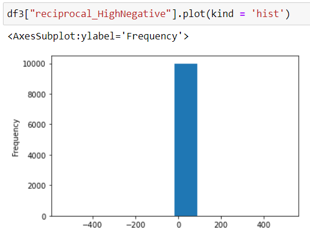
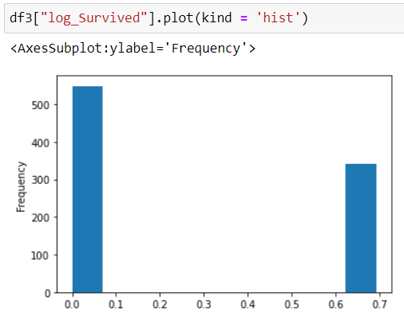
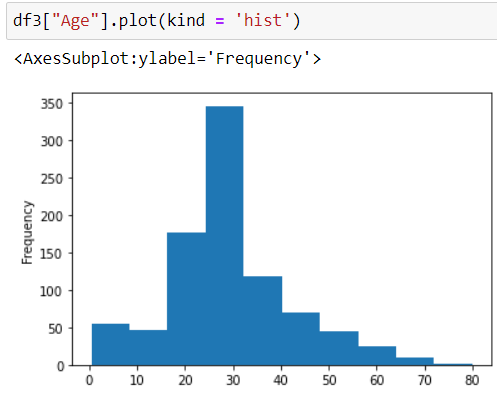

# EX-06-Feature-Transformation

## AIM
To Perform the various feature transformation techniques on a dataset and save the data to a file. 

# Explanation
Feature Transformation is a mathematical transformation in which we apply a mathematical formula to a particular column(feature) and transform the values which are useful for our further analysis.

 
# ALGORITHM
### STEP 1
Read the given Data.
### STEP 2
Clean the Data Set using Data Cleaning Process.
### STEP 3
Apply Feature Transformation techniques to all the feature of the data set.
### STEP 4
Save the data to the file.

## Types Of Transformations For Better Normal Distribution:

### Log Transformation

Log transformations make our data close to a normal distribution but are not able to exactly abide by a normal distribution.This transformation is mostly applied to right-skewed data.

### Square-Root Transformation

Square-Root transformation will give a moderate effect on distribution. The main advantage of square root transformation is, it can be applied to zero values.

### Reciprocal Transformation

Reciprocal transformation reverses the order among values of the same sign, so large values become smaller and vice-versa.This transformation is not defined for zero.It is a powerful transformation with a radical effect.

### Box-Cox Transformation

Box-cox requires the input data to be strictly positive(not even zero is acceptable).All the values of lambda vary from -5 to 5 are considered and the best value for the data is selected. The “Best” value is one that results in the best skewness of the distribution.Box-cox function reduced the skewness and it is almost equal to zero.

### Yeo-Johnson Transformation

Yeo-Johnson is best suited for features that have zeroes or negative values
YEO-JOHNSON TRANSFORMATION:  It is a variation of the Box-Cox transform.

# DataSet 1- Data_To_Transfer.csv
# CODE
```
Developed By: Sowmiya N.
Register Number : 212221230106.
```

```
import numpy as np
import pandas as pd
import seaborn as sns
import statsmodels.api as sm
import scipy.stats as stats
import matplotlib.pyplot as plt

df=pd.read_csv("Data_to_Transform.csv")
df

df1=df.copy()
log_ModPositive = np.log1p(df1["Moderate Positive Skew"])
log_HighPositive = np.log1p(df1["Highly Positive Skew"])
log_ModNegative = np.log1p(df1["Moderate Negative Skew"])
log_HighNegative = np.log1p(df1["Highly Negative Skew"])
df1.insert(1,"log_ModPositive",log_ModPositive)
df1.insert(3,"log_HighPositive",log_HighPositive)
df1.insert(5,"log_ModNegative",log_ModNegative)
df1.insert(7,"log_HighNegative",log_HighNegative)
df1

df1["Moderate Positive Skew"].plot(kind = 'hist')
df1["log_ModPositive"].plot(kind = 'hist')
df1["Highly Positive Skew"].plot(kind = 'hist')
df1["log_HighPositive"].plot(kind = 'hist')
df1["Moderate Negative Skew"].plot(kind = 'hist')
df1["log_ModNegative"].plot(kind = 'hist')
df1["Highly Negative Skew"].plot(kind = 'hist')
df1["log_HighNegative"].plot(kind = 'hist')

df2=df.copy()
sqrt_ModPositive = df["Moderate Positive Skew"]**(1/2)
sqrt_HighPositive = df["Highly Positive Skew"]**(1/2)
sqrt_ModNegative = df["Moderate Negative Skew"]**(1/2)
sqrt_HighNegative = df["Highly Negative Skew"]**(1/2)
df2.insert(1,"sqrt_ModPositive",sqrt_ModPositive)
df2.insert(3,"sqrt_HighPositive",sqrt_HighPositive)
df2.insert(5,"sqrt_ModNegative",sqrt_ModNegative)
df2.insert(7,"sqrt_HighNegative",sqrt_HighNegative)
df2

df2["Moderate Positive Skew"].plot(kind = 'hist')
df2["sqrt_ModPositive"].plot(kind = 'hist')
df2["Highly Positive Skew"].plot(kind = 'hist')
df2["sqrt_HighPositive"].plot(kind = 'hist')
df2["Moderate Negative Skew"].plot(kind = 'hist')
df2["sqrt_ModNegative"].plot(kind = 'hist')
df2["Highly Negative Skew"].plot(kind = 'hist')
df2["sqrt_HighNegative"].plot(kind = 'hist')

df3=df.copy()
reciprocal_ModPositive = 1/df["Moderate Positive Skew"]
reciprocal_HighPositive = 1/df["Highly Positive Skew"]
reciprocal_ModNegative = 1/df["Moderate Negative Skew"]
reciprocal_HighNegative = 1/df["Highly Negative Skew"]
df3.insert(1,"reciprocal_ModPositive",reciprocal_ModPositive)
df3.insert(3,"reciprocal_HighPositive",reciprocal_HighPositive)
df3.insert(5,"reciprocal_ModNegative",reciprocal_ModNegative)
df3.insert(7,"reciprocal_HighNegative",reciprocal_HighNegative)
df3

df3["reciprocal_ModPositive"].plot(kind = 'hist')
df3["reciprocal_HighPositive"].plot(kind = 'hist')
df3["reciprocal_ModNegative"].plot(kind = 'hist')
df3["reciprocal_HighNegative"].plot(kind = 'hist')

from scipy.stats import boxcox
df4=df.copy()
bcx_ModPositive, lam = boxcox(df["Moderate Positive Skew"])
bcx_HighPositive, lam = boxcox(df["Highly Positive Skew"])
df4.insert(1,"bcx_ModPositive",bcx_ModPositive)
df4.insert(3,"bcx_HighPositive",bcx_HighPositive)
df4

df4["bcx_ModPositive"].plot(kind = 'hist')
df4["bcx_HighPositive"].plot(kind = 'hist')

from scipy.stats import yeojohnson
df5=df.copy()
yf_ModPositive, lam = yeojohnson(df["Moderate Positive Skew"])
yf_HighPositive, lam = yeojohnson(df["Highly Negative Skew"])
yf_ModNegative, lam = yeojohnson(df["Moderate Negative Skew"])
yf_HighNegative, lam = yeojohnson(df["Highly Negative Skew"])
df5.insert(1,"yf_ModPositive",yf_ModPositive)
df5.insert(3,"yf_HighPositive",yf_HighPositive)
df5.insert(5,"yf_ModNegative",yf_ModNegative)
df5.insert(7,"yf_HighNegative",yf_HighNegative)
df5

df5["yf_ModPositive"].plot(kind = 'hist')
df5["yf_HighPositive"].plot(kind = 'hist')
df5["yf_ModNegative"].plot(kind = 'hist')
df5["yf_HighNegative"].plot(kind = 'hist')

```
# OUPUT

### Initial DataFrame:


### Applying Log Transformation Method to the given DataFrame:


### Column - Moderate Positive Skew

### Original:

### Log Transformed:


### Column - Highly Positive Skew

### Original:

### Log Transformed:


### Column - Moderate Negative Skew

### Original:

### Log Transformed:


### Column - Highly Negative Skew

### Original:

### Log Transformed:


### Applying Square-Root Transformation Method to the given DataFrame:


### Column - Moderate Positive Skew

### Original:

### Square-Root Transformed:


### Column - Highly Positive Skew

### Original:

### Square-Root Transformed:


### Column - Moderate Negative Skew

### Original:

### Square-Root Transformed:


### Column - Highly Negative Skew

### Original:

### Square-Root Transformed:


### Applying Reciprocal Transformation Method to the given DataFrame:


### Column - Moderate Positive Skew

### Original:

### Inverse Transformed:


### Column - Highly Positive Skew

### Original:

### Inverse Transformed:


### Column - Moderate Negative Skew

### Original:

### Inverse Transformed:


### Column - Highly Negative Skew

### Original:

### Inverse Transformed:


### Applying Box-Cox Transformation Method to the given DataFrame:
```
Box-cox requires the input data to be STRICTLY POSITIVE (not even zero is acceptable).
```

### Column - Moderate Positive Skew

### Original:

### Box-Cox Transformed:


### Column - Highly Positive Skew

### Original:

### Box-Cox Transformed:


### Applying Yeo-Johnson Transformation Method to the given DataFrame:

### Column - Moderate Positive Skew

### Original:

### Y-J Transformed:


### Column - Highly Positive Skew

### Original:

### Y-J Transformed:


### Column - Moderate Negative Skew

### Original:

### Y-J Transformed:


### Column - Highly Negative Skew

### Original:

### Y-J Transformed:


# DataSet 2- titanic.csv
# CODE
```
Developed By: Sowmiya N.
Register Number : 212221230106.
```

```
import numpy as np
import pandas as pd
import seaborn as sns
import statsmodels.api as sm
import scipy.stats as stats
import matplotlib.pyplot as plt

df=pd.read_csv("titanic_dataset.csv")
df

df.drop("Name",axis=1,inplace=True)
df.drop("Cabin",axis=1,inplace=True)
df.drop("Ticket",axis=1,inplace=True)
df
df.info()
df.isnull().sum()
df["Age"]=df["Age"].fillna(df["Age"].median())
df["Embarked"]=df["Embarked"].fillna(df["Embarked"].mode()[0])
df.isnull().sum()
df
from sklearn.preprocessing import LabelEncoder, OrdinalEncoder
oe=OrdinalEncoder()
oe.fit_transform(df[["Embarked"]])
embark=['S','C','Q']
enc=OrdinalEncoder(categories=[embark])
enc
enc.fit_transform(df[['Embarked']])
df1=df.copy()
df1["Embarked"]=enc.fit_transform(df[["Embarked"]])
df1
pip install category_encoders
from category_encoders import BinaryEncoder
be=BinaryEncoder()
newdata=be.fit_transform(df1["Sex"])
newdata
df2=df1.copy()
df2["Sex"]=be.fit_transform(df1[["Sex"]])
df2

df3=df2.copy()
log_PassengerId = np.log1p(df3["PassengerId"])
log_Survived = np.log1p(df3["Survived"])
log_Pclass = np.log1p(df3["Pclass"])
log_Sex = np.log1p(df3["Sex"])
log_Age = np.log1p(df3["Age"])
log_SibSp = np.log1p(df3["SibSp"])
log_Parch = np.log1p(df3["Parch"])
log_Fare = np.log1p(df3["Fare"])
log_Embarked = np.log1p(df3["Embarked"])
df3.insert(1,"log_PassengerId",log_PassengerId)
df3.insert(3,"log_Survived",log_Survived)
df3.insert(5,"log_Pclass",log_Pclass)
df3.insert(7,"log_Sex",log_Sex)
df3.insert(9,"log_Age",log_Age)
df3.insert(11,"log_SibSp",log_SibSp)
df3.insert(13,"log_Parch",log_Parch)
df3.insert(15,"log_Fare",log_Fare)
df3.insert(17,"log_Embarked",log_Embarked)
df3

df3["PassengerId"].plot(kind = 'hist')
df3["log_PassengerId"].plot(kind = 'hist')
df3["Survived"].plot(kind = 'hist')
df3["log_Survived"].plot(kind = 'hist')
df3["Pclass"].plot(kind = 'hist')
df3["log_Pclass"].plot(kind = 'hist')
df3["Sex"].plot(kind = 'hist')
df3["log_Sex"].plot(kind = 'hist')
df3["Age"].plot(kind = 'hist')
df3["log_Age"].plot(kind = 'hist')
df3["SibSp"].plot(kind = 'hist')
df3["log_SibSp"].plot(kind = 'hist')
df3["Parch"].plot(kind = 'hist')
df3["log_Parch"].plot(kind = 'hist')
df3["Fare"].plot(kind = 'hist')
df3["log_Fare"].plot(kind = 'hist')
df3["Embarked"].plot(kind = 'hist')
df3["log_Embarked"].plot(kind = 'hist')

df4=df2.copy()
sqrt_PassengerId = df2["PassengerId"]**(1/2)
sqrt_Survived = df2["Survived"]**(1/2)
sqrt_Pclass = df2["Pclass"]**(1/2)
sqrt_Sex = df2["Sex"]**(1/2)
sqrt_Age = df2["Age"]**(1/2)
sqrt_SibSp = df2["SibSp"]**(1/2)
sqrt_Parch = df2["Parch"]**(1/2)
sqrt_Fare = df2["Fare"]**(1/2)
sqrt_Embarked = df2["Embarked"]**(1/2)
df4.insert(1,"sqrt_PassengerId",sqrt_PassengerId)
df4.insert(3,"sqrt_Survived",sqrt_Survived)
df4.insert(5,"sqrt_Pclass",sqrt_Pclass)
df4.insert(7,"sqrt_Sex",sqrt_Sex)
df4.insert(9,"sqrt_Age",sqrt_Age)
df4.insert(11,"sqrt_SibSp",sqrt_SibSp)
df4.insert(13,"sqrt_Parch",sqrt_Parch)
df4.insert(15,"sqrt_Fare",sqrt_Fare)
df4.insert(17,"sqrt_Embarked",sqrt_Embarked)
df4

df4["sqrt_PassengerId"].plot(kind = 'hist')
df4["sqrt_Survived"].plot(kind = 'hist')
df4["sqrt_Pclass"].plot(kind = 'hist')
df4["sqrt_Sex"].plot(kind = 'hist')
df4["sqrt_Age"].plot(kind = 'hist')
df4["sqrt_SibSp"].plot(kind = 'hist')
df4["sqrt_Parch"].plot(kind = 'hist')
df4["sqrt_Fare"].plot(kind = 'hist')
df4["sqrt_Embarked"].plot(kind = 'hist')

df5=df2.copy()
reciprocal_PassengerId = 1/df["PassengerId"]
reciprocal_Survived = 1/df["Survived"]
reciprocal_Pclass = 1/df["Pclass"]
reciprocal_Age = 1/df["Age"]
reciprocal_SibSp = 1/df["SibSp"]
reciprocal_Parch = 1/df["Parch"]
reciprocal_Fare = 1/df["Fare"]
df5.insert(1,"reciprocal_PassengerId",reciprocal_PassengerId)
df5.insert(3,"reciprocal_Survived",reciprocal_Survived)
df5.insert(5,"reciprocal_Pclass",reciprocal_Pclass)
df5.insert(8,"reciprocal_Age",reciprocal_Age)
df5.insert(10,"reciprocal_SibSp",reciprocal_SibSp)
df5.insert(12,"reciprocal_Parch",reciprocal_Parch)
df5.insert(14,"reciprocal_Fare",reciprocal_Fare)
df5

df5["reciprocal_PassengerId"].plot(kind = 'hist')
df5["reciprocal_Pclass"].plot(kind = 'hist')
df5["reciprocal_Age"].plot(kind = 'hist')

from scipy.stats import boxcox
df6=df2.copy()
bcx_PassengerId, lam = boxcox(df2["PassengerId"])
bcx_Pclass, lam = boxcox(df2["Pclass"])
bcx_Age, lam = boxcox(df2["Age"])
df6.insert(1,"bcx_PassengerId",bcx_PassengerId)
df6.insert(4,"bcx_Pclass",bcx_Pclass)
df6.insert(7,"bcx_Age",bcx_Age)
df6

df6["bcx_PassengerId"].plot(kind = 'hist')
df6["bcx_Pclass"].plot(kind = 'hist')
df6["bcx_Age"].plot(kind = 'hist')

from scipy.stats import yeojohnson
df7=df2.copy()
yf_PassengerId, lam = yeojohnson(df["PassengerId"])
yf_Survived, lam = yeojohnson(df["Survived"])
yf_Pclass, lam = yeojohnson(df["Pclass"])
yf_Age, lam = yeojohnson(df["Age"])
yf_SibSp, lam = yeojohnson(df["SibSp"])
yf_Parch, lam = yeojohnson(df["Parch"])
yf_Fare, lam = yeojohnson(df["Fare"])
df7.insert(1,"yf_PassengerId",yf_PassengerId)
df7.insert(3,"yf_Survived",yf_Survived)
df7.insert(5,"yf_Pclass",yf_Pclass)
df7.insert(8,"yf_Age",yf_Age)
df7.insert(10,"yf_SibSp",yf_SibSp)
df7.insert(12,"yf_Parch",yf_Parch)
df7.insert(14,"yf_Fare",yf_Fare)
df7

df7["yf_PassengerId"].plot(kind = 'hist')
df7["yf_Survived"].plot(kind = 'hist')
df7["yf_Pclass"].plot(kind = 'hist')
df7["yf_Age"].plot(kind = 'hist')
df7["yf_SibSp"].plot(kind = 'hist')
df7["yf_Parch"].plot(kind = 'hist')
df7["yf_Fare"].plot(kind = 'hist')
```
# OUPUT

### Initial DataFrame:

### Droping Name,Cabin,Ticket columns from DataFrame:

### Non Null-data Count:

### Sum of null data present in each column:

### Handling Null data in Column "Age" and "Embarked" :

### Data Frame after removing column - Name,Cabin,Ticket:

### Applying Ordinal Encoding Method in column - Embarked:

### Applying Binary Encoding Method in column - Sex:

### Applying Log Transformation Method to the given DataFrame:


### Column - PassengerId:
### Original:

### Log Transformed:

### Column - Survived:
### Original:

### Log Transformed:

### Column - Pclass:
### Original:

### Log Transformed:

### Column - Sex:
### Original:

### Log Transformed:

### Column - Age:
### Original:

### Log Transformed:

### Column - SibSp:
### Original:

### Log Transformed:

### Column - Parch:
### Original:

### Log Transformed:

### Column - Fare:
### Original:

### Log Transformed:

### Column - Embarked:
### Original:

### Log Transformed:


### Applying Square-Root Transformation Method to the given DataFrame:


### Column - PassengerId:
### Original:

### Square-Root Transformed:


### Column - Survived:
### Original:

### Square-Root Transformed:


### Column - Pclass:
### Original:

### Square-Root Transformed:


### Column - Sex:
### Original:

### Square-Root Transformed:


### Column - Age:
### Original:

### Square-Root Transformed:


### Column - SibSp:
### Original:

### Square-Root Transformed:


### Column - Parch:
### Original:

### Square-Root Transformed:


### Column - Fare:
### Original:

### Square-Root Transformed:


### Column - Embarked:
### Original:

### Square-Root Transformed:


### Applying Box-Cox Transformation Method to the given DataFrame:
```
Box-cox requires the input data to be STRICTLY POSITIVE (not even zero is acceptable).
```


### Column - PassengerId:
### Original:

### Box-Cox Transformed:

### Column - Pclass:
### Original:

### Box-Cox Transformed:

### Column - Age:
### Original:

### Box-Cox Transformed:


## Result
 Various feature transformation techniques are performed on a given dataset for the better fit of normality successfully.


